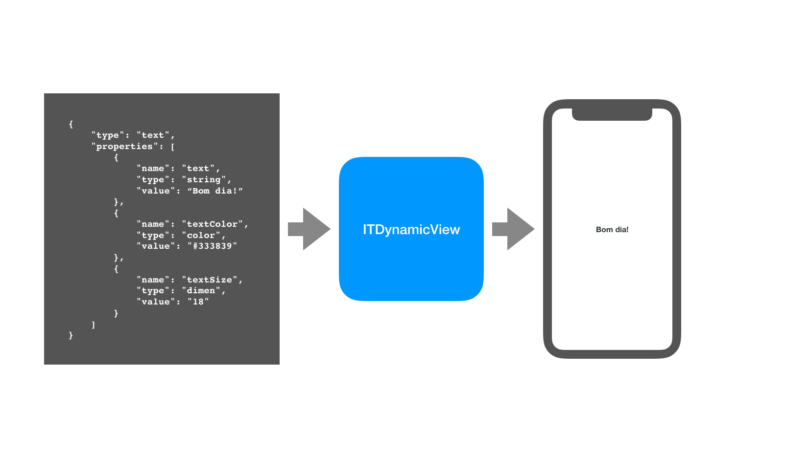

# Yosef

[](https://travis-ci.org/guibayma/Yosef)
[](http://cocoapods.org/pods/Yosef)
[](http://cocoapods.org/pods/Yosef)
[](http://cocoapods.org/pods/Yosef)

A lib tem como função criar views a partir de jsons, de modo que seja possível (1) alterar a interface do app no servidor e (2) acrescentar novas funcionalidades sem a necessidade de atualizar o app.



## DynamicView

A lib tem uma class central `DynamicView`, cujo método `createView()`, que recebe um `DynamicComponent` e um `DynamicActionDelegate`, é um ponto central para qualquer user externo.

O `DynamicComponent` é a representação do JSON com as informações necessárias para a criação da View (o `type`, as `properties` e as `children`).

## DynamicComponent

O `DynamicComponent` é o objeto que encapsula as informações sobre as views que serão criadas pela lib. Ele contém três principais informações: 

- `type`: uma `String` informando se é um "botão", "texto", etc.
- `properties`: um `Array<DynamicProperty>` que contém informações como "textColor", "textSize", "action", etc.
- `children`: um `Array<DynamicComponent>?` que contém componentes que devem ser exibidos, dentro do componente a ser criado.

O `DynamicComponent` possui um factory method `parse(dictionary: [String: Any])` que deve ser usado para criar uma instância de um dicionário do json retornado pelo servidor.

## Exemplo

Diagamos que temos um View Controller cuja View deve ser populada com as informações retornadas pelo servidor, representadas como um dicionário `[String: Any]`. O código ficaria assim:

```swift
func updateUI() {
    // 1
    let comp = DynamicComponent.parse(dictionary: info)
    // 2
    let view = DynamicView.createView(dynamicsComponent: comp, actionDelegate: self)
    // 3
    self.view.addSubview(view)
    view.translatesAutoresizingMaskIntoConstraints = false
    view.topAnchor.constraint(equalTo: self.view.topAnchor, constant: 20).isActive = true
    view.leadingAnchor.constraint(equalTo: self.view.leadingAnchor, constant: 20).isActive = true
    view.trailingAnchor.constraint(equalTo: self.view.trailingAnchor, constant: -20).isActive = true
}
```
Uma explicação do código:

1. É criado um `DynamicComponent` usando o `parse` factory method.
2. A partir do componente criado, é criado a view usando o método `createView`.
3. A view criada é adicionada como subview e é utilizado autolayout para fixá-la nas âncoras do topo, esquerda e direita da View Controller.

## Instalação

O `Yosef` está disponível via [CocoaPods](http://cocoapods.org).
Para instalar é necessário adicionar as linhas abaixo no seu ```Podfile``` e rodar o `pod install`:

```ruby
pod "Yosef"
```
## Requisitos para desenvolvimento

Para ter o ambiente de desenvolvimento adequado utilize o [Bundler](http://bundler.io/) para instalar o ```Gemfile``` do projeto

O projeto pode ser acessado na pasta `Example`, abrindo o workspace `Yosef.workspace`.

## Dependências

 - [lottie-ios](https://github.com/airbnb/lottie-ios)
 - [Kingfisher](https://github.com/onevcat/Kingfisher)

## Testes

### Testes unitários

Para os testes unitários, usamos `XCTestCase`. No caso de testes das views retornadas pela lib, usamos também a [iOSSnapshotTestCase](https://github.com/facebookarchive/ios-snapshot-test-case).

### Cobertura

A cobertura de testes pode ser obtida rodando o script `test.sh`:

```ruby
$ sh test.sh
```
Os resultados podem ser acessados abrindo a página `index.html` na pasta `coverage_report`

## Equipe iOS

Guilherme Bayma, guilherme.bayma@concrete.com.br  
Emannuel Carvalho, emannuel.carvalho@concrete.com.br

## License

Yosef is available under the MIT license. See the LICENSE file for more info.
